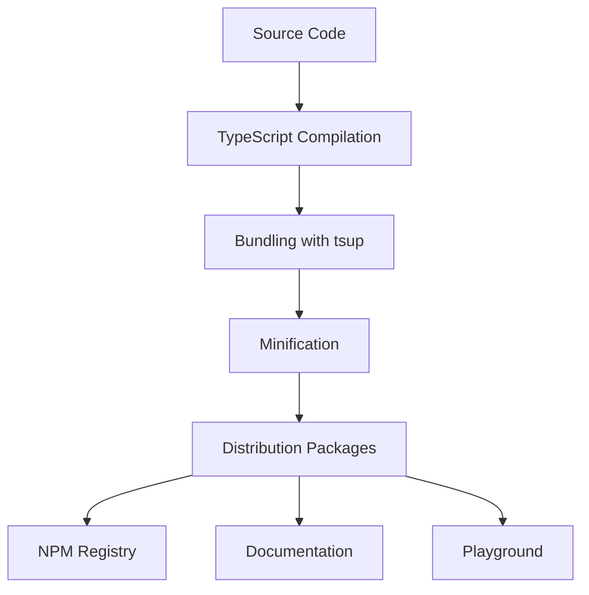

# Architecture Overview

This document provides a comprehensive overview of the Elements UI library's architecture, design decisions, and project structure.

## Table of Contents

- [Project Structure](#project-structure)
- [Monorepo Approach](#monorepo-approach)
- [Package Organization](#package-organization)
- [Technology Stack](#technology-stack)
- [Design System](#design-system)
- [Build System](#build-system)
- [Development Workflow](#development-workflow)
- [Key Design Decisions](#key-design-decisions)
- [Scalability Considerations](#scalability-considerations)
- [Future Roadmap](#future-roadmap)

## Project Structure

The Elements UI library is organized as a monorepo with the following structure:

```
elements/
├── packages/
│   ├── core/                    # Design tokens and theme system
│   │   ├── src/
│   │   │   ├── index.ts        # Main exports
│   │   │   ├── tokens.ts       # Design tokens
│   │   │   └── theme.ts        # Theme utilities
│   │   ├── package.json
│   │   └── tailwind.config.cjs # Tailwind configuration
│   │
│   ├── react/                   # React components
│   │   ├── src/
│   │   │   ├── index.ts        # Main exports
│   │   │   ├── components/     # Component library
│   │   │   │   ├── button/
│   │   │   │   ├── input/
│   │   │   │   └── ...
│   │   │   └── index.css       # Global styles
│   │   ├── package.json
│   │   └── tsup.config.ts      # Build configuration
│   │
│   ├── docs/                    # Storybook documentation
│   │   ├── .storybook/
│   │   │   ├── main.ts         # Storybook configuration
│   │   │   └── preview.tsx     # Storybook preview
│   │   ├── package.json
│   │   └── tailwind.config.cjs # Tailwind configuration
│   │
│   └── playground/              # Development environment
│       ├── src/
│       │   ├── App.tsx         # Main app component
│       │   ├── index.css       # Global styles
│       │   └── main.tsx        # Entry point
│       ├── package.json
│       ├── vite.config.ts      # Vite configuration
│       └── tailwind.config.cjs # Tailwind configuration
│
├── docs/                        # Documentation
│   ├── README.md               # Main documentation
│   ├── contributing/           # Contributor guides
│   ├── usage/                  # User guides
│   └── architecture/           # Architecture docs
│
├── .github/                    # GitHub workflows
├── package.json                # Root package.json
├── pnpm-workspace.yaml         # Workspace configuration
├── tailwind.config.cjs         # Root Tailwind config
└── postcss.config.cjs          # PostCSS configuration
```

## Monorepo Approach

### Why Monorepo?

The Elements UI library uses a monorepo architecture for several key reasons:

1. **Code Sharing**: Common packages (like `core`) can be easily shared across multiple packages
2. **Atomic Commits**: Changes to multiple packages can be committed together
3. **Simplified Dependencies**: All packages are versioned together, avoiding dependency conflicts
4. **Unified Tooling**: Shared configuration and tooling across all packages
5. **Easier Testing**: Integration testing across packages is simplified

### Workspace Configuration

The project uses pnpm workspaces to manage the monorepo:

```yaml
# pnpm-workspace.yaml
packages:
  - "packages/*"
```

This configuration tells pnpm to treat all directories under `packages/` as separate packages that can be managed together.

## Package Organization

### Core Package (`@bitbybit-b3/elements-core`)

The `core` package contains the foundational design system:

```typescript
// packages/core/src/index.ts
export * from "./tokens";
export * from "./theme";
```

**Responsibilities:**

- Design tokens (colors, spacing, typography, etc.)
- Theme management system
- Tailwind CSS configuration
- Shared utilities and constants

**Key Features:**

- Type-safe design tokens
- Light/dark theme support
- Extensible theme system
- Tailwind CSS integration

### React Package (`@bitbybit-b3/elements-react`)

The `react` package contains the actual UI components:

```typescript
// packages/react/src/index.ts
export { Button } from "./components/button/button";
// ... other components
```

**Responsibilities:**

- React component implementations
- Component-specific styling
- TypeScript definitions
- Accessibility features

**Key Features:**

- Forward ref support
- TypeScript-first development
- Accessibility compliance
- Consistent API design

### Docs Package (`@bitbybit-b3/elements-docs`)

The `docs` package contains Storybook documentation:

```typescript
// packages/docs/package.json
{
  "name": "@bitbybit-b3/elements-docs",
  "scripts": {
    "storybook": "storybook dev -p 6006",
    "build-storybook": "storybook build"
  }
}
```

**Responsibilities:**

- Component documentation
- Interactive examples
- Design system showcase
- API reference

**Key Features:**

- Storybook for component development
- Interactive documentation
- Auto-generated API docs
- Accessibility testing

### Playground Package (`@bitbybit-b3/elements-playground`)

The `playground` package provides a development environment:

```typescript
// packages/playground/package.json
{
  "name": "@bitbybit-b3/elements-playground",
  "scripts": {
    "dev": "vite",
    "build": "tsc && vite build"
  }
}
```

**Responsibilities:**

- Development environment
- Testing components
- Prototyping features
- Integration testing

**Key Features:**

- Hot module replacement
- Fast development server
- Real-time component testing
- Integration with design tokens

## Technology Stack

### Core Technologies

- **TypeScript**: Full type safety across all packages
- **React**: Modern React with hooks and functional components
- **Tailwind CSS**: Utility-first CSS framework
- **pnpm**: Fast, disk space efficient package manager

### Build Tools

- **tsup**: Fast TypeScript bundler
- **Vite**: Next-generation frontend build tool
- **Storybook**: Component development and documentation
- **PostCSS**: CSS transformation tool

### Development Tools

- **ESLint**: Code linting and style enforcement
- **Prettier**: Code formatting
- **Jest**: Unit testing framework
- **React Testing Library**: Testing utilities for React components

## Design System

### Token-Based Architecture

The design system is built around a token-based architecture:

```typescript
// packages/core/src/tokens.ts
export interface ThemeTokens {
  colors: {
    primary: {
      /* color scale */
    };
    secondary: {
      /* color scale */
    };
    background: string;
    foreground: string;
    // ... more colors
  };
  spacing: {
    xs: string;
    sm: string;
    md: string;
    // ... more spacing
  };
  // ... more token categories
}
```

### Design Principles

1. **Consistency**: All components use the same design tokens
2. **Flexibility**: Tokens can be customized and extended
3. **Accessibility**: WCAG-compliant color contrast and focus management
4. **Performance**: Minimal CSS output with Tailwind CSS
5. **Maintainability**: Centralized design decisions

### Color System

The color system uses a scale-based approach:

```typescript
colors: {
  primary: {
    50: '#eff6ff',    // Lightest
    100: '#dbeafe',
    200: '#bfdbfe',
    300: '#93c5fd',
    400: '#60a5fa',
    500: '#3b82f6',    // Base
    600: '#2563eb',
    700: '#1d4ed8',
    800: '#1e40af',
    900: '#1e3a8a',    // Darkest
  },
  // ... other color scales
}
```

## Build System

### Build Pipeline

The build system is optimized for performance and developer experience:



### Package Builds

Each package has its own build configuration:

```typescript
// packages/core/tsup.config.ts
export default {
  entry: ["src/index.ts"],
  format: ["cjs", "esm"],
  dts: true,
  splitting: false,
  sourcemap: true,
};
```

### Development Builds

Development builds are optimized for speed:

```typescript
// packages/playground/vite.config.ts
export default {
  plugins: [react()],
  server: {
    port: 3000,
    open: true,
  },
  optimizeDeps: {
    include: ["react", "react-dom"],
  },
};
```

## Development Workflow

### Local Development

1. **Install dependencies**: `pnpm install`
2. **Start development servers**: `pnpm dev` (playground) and `pnpm storybook` (docs)
3. **Make changes**: Edit source files in the appropriate package
4. **Test changes**: See results in the playground and Storybook
5. **Run tests**: `pnpm test`
6. **Build packages**: `pnpm build`

### Code Organization

- **Packages**: Each package has a specific responsibility
- **Components**: Components are organized by feature
- **Utilities**: Shared utilities are in the core package
- **Types**: TypeScript types are co-located with implementations

### Testing Strategy

- **Unit Tests**: Jest with React Testing Library
- **Component Tests**: Storybook with accessibility testing
- **Integration Tests**: Playground environment
- **Type Tests**: TypeScript compiler

## Key Design Decisions

### 1. Tailwind-Only Approach

**Decision**: Use only Tailwind CSS classes, no custom CSS

**Rationale**:

- Consistent styling across components
- Reduced CSS bundle size
- Better developer experience with utility classes
- Easier theming and customization

**Implementation**:

```tsx
// All styling uses Tailwind classes
const Button = forwardRef<HTMLButtonElement, ButtonProps>(
  ({ variant = "default", size = "default", ...props }, ref) => {
    return (
      <button
        ref={ref}
        className={`
          inline-flex items-center justify-center rounded-md
          transition-colors focus-visible:outline-none
          focus-visible:ring-2 focus-visible:ring-offset-2
          ${variantStyles[variant]}
          ${sizeStyles[size]}
          ${props.className}
        `}
        {...props}
      >
        {props.children}
      </button>
    );
  }
);
```

### 2. Design Token System

**Decision**: Centralized design tokens with TypeScript types

**Rationale**:

- Consistent design across components
- Easy theming and customization
- Type safety for design values
- Scalable design system

**Implementation**:

```typescript
// packages/core/src/tokens.ts
export const lightTokens: ThemeTokens = {
  colors: {
    primary: {
      /* color scale */
    },
    // ... other colors
  },
  spacing: {
    xs: "0.25rem",
    sm: "0.5rem",
    // ... other spacing
  },
  // ... other tokens
};
```

### 3. Monorepo Structure

**Decision**: Use pnpm workspaces for monorepo management

**Rationale**:

- Code sharing between packages
- Unified dependency management
- Simplified development workflow
- Better tooling integration

**Implementation**:

```yaml
# pnpm-workspace.yaml
packages:
  - "packages/*"
```

### 4. TypeScript-First Development

**Decision**: Full TypeScript support with strict type checking

**Rationale**:

- Better developer experience
- Catch errors at compile time
- Improved code maintainability
- Better IDE support

**Implementation**:

```typescript
// packages/react/src/components/button/button.tsx
export interface ButtonProps
  extends React.ButtonHTMLAttributes<HTMLButtonElement> {
  variant?: "default" | "primary" | "secondary";
  size?: "sm" | "md" | "lg";
  loading?: boolean;
}
```

### 5. Component Composition

**Decision**: Build components that can be composed together

**Rationale**:

- Flexible component usage
- Reusable building blocks
- Consistent API design
- Better accessibility

**Implementation**:

```tsx
// Components can be composed
<Card>
  <CardHeader>
    <CardTitle>Card Title</CardTitle>
  </CardHeader>
  <CardContent>
    <p>Card content</p>
  </CardContent>
  <CardFooter>
    <Button>Action</Button>
  </CardFooter>
</Card>
```

## Scalability Considerations

### 1. Package Structure

The monorepo structure allows for easy scaling:

- **New Packages**: Add new packages under `packages/`
- **New Features**: Add new components to existing packages
- **New Teams**: Different teams can work on different packages
- **New Technologies**: New technologies can be added to specific packages

### 2. Performance Optimization

The build system is optimized for performance:

- **Tree Shaking**: Only include used components
- **Code Splitting**: Automatic code splitting for large bundles
- **Caching**: Build caching for faster builds
- **Optimization**: Optimized production builds

### 3. Developer Experience

The development experience is optimized for productivity:

- **Fast Refresh**: Instant feedback on changes
- **Type Safety**: Full TypeScript support
- **Tooling Integration**: IDE and tooling integration
- **Documentation**: Comprehensive documentation

### 4. Maintenance

The architecture is designed for easy maintenance:

- **Clear Boundaries**: Each package has clear responsibilities
- **Shared Code**: Common code is centralized
- **Testing**: Comprehensive testing strategy
- **Documentation**: Clear documentation and guides

## Future Roadmap

### Short-term Goals

1. **Component Library Expansion**

   - Add more commonly used components
   - Improve existing component APIs
   - Add accessibility features

2. **Performance Improvements**

   - Optimize bundle sizes
   - Improve build times
   - Add performance monitoring

3. **Developer Experience**
   - Better tooling integration
   - Improved documentation
   - Enhanced debugging capabilities

### Long-term Goals

1. **Multi-Framework Support**

   - Vue.js components
   - Svelte components
   - Angular components

2. **Advanced Theming**

   - Dynamic theming
   - Custom theme generation
   - Theme marketplace

3. **Design System Evolution**

   - Advanced design tokens
   - Animation system
   - Layout system

4. **Ecosystem Growth**
   - Plugin system
   - Community contributions
   - Third-party integrations

## Contributing to Architecture

### Making Changes

When making architectural changes:

1. **Consider the Impact**: Understand how changes affect all packages
2. **Follow Principles**: Adhere to the established architectural principles
3. **Update Documentation**: Keep documentation up to date
4. **Test Thoroughly**: Ensure all packages work together correctly

### Proposing Changes

To propose architectural changes:

1. **Create a Proposal**: Write a detailed proposal explaining the change
2. **Gather Feedback**: Discuss with the team
3. **Create a Proof of Concept**: Implement a small version of the change
4. **Submit a Pull Request**: Follow the contribution guidelines

## Conclusion

The Elements UI library's architecture is designed to be:

- **Scalable**: Can grow with the project's needs
- **Maintainable**: Easy to understand and modify
- **Performant**: Optimized for both development and production
- **Developer-Friendly**: Excellent developer experience
- **Future-Proof**: Ready for future enhancements

This architecture provides a solid foundation for building a comprehensive UI library that can serve the needs of modern web applications.

---

**Next Steps**:

- [Design System](./design-system.md) - Detailed design system documentation
- [Package Structure](./packages.md) - Package-specific documentation
- [Development Setup](../development/setup.md) - Development environment setup
- [Component Guidelines](../contributing/component-guidelines.md) - Component development guidelines
