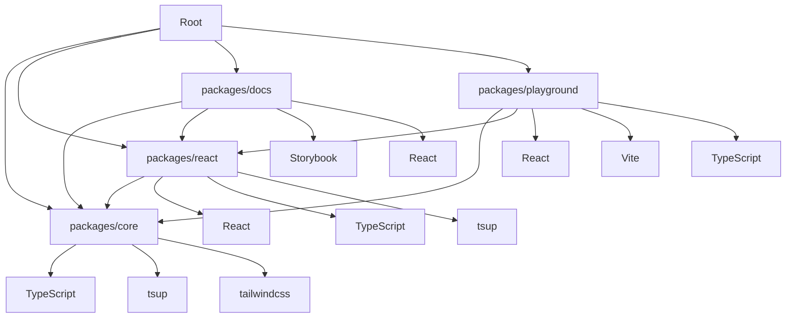

# Package Structure

This document provides detailed information about the package structure and organization of the Elements UI library.

## Table of Contents

- [Overview](#overview)
- [Core Package](#core-package)
- [React Package](#react-package)
- [Docs Package](#docs-package)
- [Playground Package](#playground-package)
- [Package Dependencies](#package-dependencies)
- [Build Configuration](#build-configuration)
- [Development Workflow](#development-workflow)
- [Package Publishing](#package-publishing)
- [Version Management](#version-management)

## Overview

The Elements UI library is organized as a monorepo with four main packages:

```
packages/
├── core/                    # Design tokens and theme system
├── react/                   # React components
├── docs/                    # Storybook documentation
└── playground/              # Development environment
```

Each package has a specific responsibility and can be developed independently while sharing common functionality.

## Core Package

### Package Information

```json
{
  "name": "@bitbybit-b3/elements-core",
  "version": "0.1.0",
  "description": "Core design tokens and theme for Elements UI library",
  "main": "dist/index.js",
  "module": "dist/index.esm.js",
  "types": "dist/index.d.ts",
  "files": ["dist"],
  "scripts": {
    "build": "tsup src/index.ts",
    "dev": "tsup src/index.ts --watch",
    "typecheck": "tsc --noEmit"
  },
  "devDependencies": {
    "typescript": "^5.0.0",
    "tsup": "^8.0.0"
  },
  "peerDependencies": {
    "tailwindcss": "^3.4.0"
  }
}
```

### Package Structure

```
packages/core/
├── src/
│   ├── index.ts           # Main exports
│   ├── tokens.ts          # Design tokens
│   └── theme.ts           # Theme utilities
├── package.json
├── tailwind.config.cjs    # Tailwind configuration
└── tsup.config.ts         # Build configuration
```

### Key Files

#### `src/index.ts`

```typescript
// Export all tokens and theme utilities
export * from "./tokens";
export * from "./theme";
```

#### `src/tokens.ts`

```typescript
// Design token definitions
export interface ThemeTokens {
  colors: {
    primary: ColorScale;
    secondary: ColorScale;
    background: string;
    foreground: string;
    // ... more colors
  };
  spacing: SpacingScale;
  borderRadius: BorderRadiusScale;
  fontSize: FontSizeScale;
  fontWeight: FontWeightScale;
  lineHeight: LineHeightScale;
}

// Light theme tokens
export const lightTokens: ThemeTokens = {
  colors: {
    primary: {
      50: "#eff6ff",
      100: "#dbeafe",
      // ... color scale
    },
    // ... other colors
  },
  // ... other tokens
};

// Dark theme tokens
export const darkTokens: ThemeTokens = {
  colors: {
    primary: {
      50: "#1e3a8a",
      100: "#1e40af",
      // ... color scale
    },
    // ... other colors
  },
  // ... other tokens
};
```

#### `src/theme.ts`

```typescript
// Theme management utilities
import { lightTokens, darkTokens, ThemeTokens } from "./tokens";

export type ThemeMode = "light" | "dark";

export interface Theme {
  mode: ThemeMode;
  tokens: ThemeTokens;
}

export const defaultTheme: Theme = {
  mode: "light",
  tokens: lightTokens,
};

export function setTheme(mode: ThemeMode): Theme {
  const tokens = mode === "light" ? lightTokens : darkTokens;
  return {
    mode,
    tokens,
  };
}

export function getCurrentTheme(): Theme {
  // In a real implementation, this would read from localStorage or system preference
  return defaultTheme;
}

export function getThemeTokens(): ThemeTokens {
  return getCurrentTheme().tokens;
}

export function isDarkMode(): boolean {
  return getCurrentTheme().mode === "dark";
}

export function toggleTheme(): Theme {
  const currentTheme = getCurrentTheme();
  const newMode = currentTheme.mode === "light" ? "dark" : "light";
  return setTheme(newMode);
}
```

### Tailwind Configuration

```javascript
// tailwind.config.cjs
const { lightTokens, darkTokens } = require("./src/tokens");

/** @type {import('tailwindcss').Config} */
module.exports = {
  darkMode: ["class"],
  content: [
    "./src/**/*.{ts,tsx}",
    "../../packages/react/src/**/*.{ts,tsx}",
    "../../packages/docs/**/*.{ts,tsx}",
    "../../packages/playground/**/*.{ts,tsx}",
  ],
  theme: {
    extend: {
      colors: {
        primary: {
          50: lightTokens.colors.primary[50],
          100: lightTokens.colors.primary[100],
          // ... rest of the scale
          dark: {
            50: darkTokens.colors.primary[50],
            100: darkTokens.colors.primary[100],
            // ... rest of the dark scale
          },
        },
        // ... other colors
      },
      spacing: {
        xs: lightTokens.spacing.xs,
        sm: lightTokens.spacing.sm,
        md: lightTokens.spacing.md,
        lg: lightTokens.spacing.lg,
        xl: lightTokens.spacing.xl,
        "2xl": lightTokens.spacing["2xl"],
        "3xl": lightTokens.spacing["3xl"],
        "4xl": lightTokens.spacing["4xl"],
      },
      borderRadius: {
        none: lightTokens.borderRadius.none,
        sm: lightTokens.borderRadius.sm,
        md: lightTokens.borderRadius.md,
        lg: lightTokens.borderRadius.lg,
        full: lightTokens.borderRadius.full,
      },
      fontSize: {
        xs: lightTokens.fontSize.xs,
        sm: lightTokens.fontSize.sm,
        base: lightTokens.fontSize.base,
        lg: lightTokens.fontSize.lg,
        xl: lightTokens.fontSize.xl,
        "2xl": lightTokens.fontSize["2xl"],
        "3xl": lightTokens.fontSize["3xl"],
        "4xl": lightTokens.fontSize["4xl"],
      },
      fontWeight: {
        light: lightTokens.fontWeight.light,
        normal: lightTokens.fontWeight.normal,
        medium: lightTokens.fontWeight.medium,
        semibold: lightTokens.fontWeight.semibold,
        bold: lightTokens.fontWeight.bold,
      },
      lineHeight: {
        tight: lightTokens.lineHeight.tight,
        normal: lightTokens.lineHeight.normal,
        relaxed: lightTokens.lineHeight.relaxed,
        loose: lightTokens.lineHeight.loose,
      },
    },
  },
  plugins: [],
};
```

### Build Configuration

```typescript
// tsup.config.ts
import { defineConfig } from "tsup";

export default defineConfig({
  entry: ["src/index.ts"],
  format: ["cjs", "esm"],
  dts: true,
  splitting: false,
  sourcemap: true,
  minify: false,
  clean: true,
});
```

## React Package

### Package Information

```json
{
  "name": "@bitbybit-b3/elements-react",
  "version": "0.1.0",
  "description": "React components library for Elements UI",
  "main": "dist/index.js",
  "module": "dist/index.esm.js",
  "types": "dist/index.d.ts",
  "files": ["dist"],
  "scripts": {
    "build": "tsup",
    "dev": "tsup --watch",
    "typecheck": "tsc --noEmit"
  },
  "dependencies": {
    "@bitbybit-b3/elements-core": "workspace:*"
  },
  "devDependencies": {
    "typescript": "^5.0.0",
    "tsup": "^8.0.0",
    "react": "^18.0.0",
    "react-dom": "^18.0.0",
    "@types/react": "^18.0.0",
    "@types/react-dom": "^18.0.0"
  },
  "peerDependencies": {
    "react": ">=18.0.0",
    "react-dom": ">=18.0.0"
  }
}
```

### Package Structure

```
packages/react/
├── src/
│   ├── index.ts           # Main exports
│   ├── index.css          # Global styles
│   ├── components/
│   │   ├── button/
│   │   │   ├── button.tsx
│   │   │   └── button.stories.tsx
│   │   ├── input/
│   │   │   ├── input.tsx
│   │   │   └── input.stories.tsx
│   │   └── ...            # Other components
│   └── main.tsx           # Entry point
├── package.json
├── tsup.config.ts         # Build configuration
└── tailwind.config.cjs    # Tailwind configuration
```

### Key Files

#### `src/index.ts`

```typescript
// Core exports - will be available after building the core package
// export * from '@bitbybit-b3/elements-core';

// Component exports
export { Button } from "./components/button/button";
export { Input } from "./components/input/input";
// ... other components

// Version
export const version = "0.1.0";
```

#### Component Template

```typescript
// packages/react/src/components/button/button.tsx
import { forwardRef } from "react";
import React from "react";

export interface ButtonProps
  extends React.DetailedHTMLProps<
    React.ButtonHTMLAttributes<HTMLButtonElement>,
    HTMLButtonElement
  > {
  variant?:
    | "default"
    | "primary"
    | "secondary"
    | "destructive"
    | "outline"
    | "ghost"
    | "link";
  size?: "default" | "sm" | "lg" | "icon";
  loading?: boolean;
  leftIcon?: React.ReactNode;
  rightIcon?: React.ReactNode;
}

const Button = forwardRef<HTMLButtonElement, ButtonProps>(
  (
    {
      className = "",
      variant = "default",
      size = "default",
      loading = false,
      leftIcon,
      rightIcon,
      disabled,
      children,
      ...props
    },
    ref
  ) => {
    const isDisabled = disabled || loading;

    return (
      <button
        ref={ref}
        disabled={isDisabled}
        className={`
          inline-flex items-center justify-center rounded-md
          text-sm font-medium transition-colors
          focus-visible:outline-none focus-visible:ring-2
          focus-visible:ring-offset-2 disabled:pointer-events-none
          disabled:opacity-50
          
          // Variant styles
          ${
            variant === "default"
              ? "bg-primary-600 text-white hover:bg-primary-700 focus:ring-primary-500"
              : ""
          }
          ${
            variant === "primary"
              ? "bg-blue-600 text-white hover:bg-blue-700 focus:ring-blue-500"
              : ""
          }
          ${
            variant === "secondary"
              ? "bg-gray-100 text-gray-900 hover:bg-gray-200 focus:ring-gray-500"
              : ""
          }
          ${
            variant === "destructive"
              ? "bg-red-600 text-white hover:bg-red-700 focus:ring-red-500"
              : ""
          }
          ${
            variant === "outline"
              ? "border border-gray-300 bg-white text-gray-700 hover:bg-gray-50 focus:ring-gray-500"
              : ""
          }
          ${
            variant === "ghost"
              ? "hover:bg-gray-100 hover:text-gray-900 focus:ring-gray-500"
              : ""
          }
          ${
            variant === "link"
              ? "text-primary-600 underline-offset-4 hover:underline focus:ring-primary-500"
              : ""
          }
          
          // Size styles
          ${size === "default" ? "h-10 px-4 py-2" : ""}
          ${size === "sm" ? "h-9 rounded-md px-3" : ""}
          ${size === "lg" ? "h-11 rounded-md px-8" : ""}
          ${size === "icon" ? "h-10 w-10" : ""}
          
          // User-provided classes
          ${className}
        `}
        {...props}
      >
        {loading && (
          <svg
            className="mr-2 h-4 w-4 animate-spin"
            fill="none"
            viewBox="0 0 24 24"
          >
            <circle
              className="opacity-25"
              cx="12"
              cy="12"
              r="10"
              stroke="currentColor"
              strokeWidth="4"
            ></circle>
            <path
              className="opacity-75"
              fill="currentColor"
              d="M4 12a8 8 0 018-8V0C5.373 0 0 5.373 0 12h4zm2 5.291A7.962 7.962 0 014 12H0c0 3.042 1.135 5.824 3 7.938l3-2.647z"
            ></path>
          </svg>
        )}
        {leftIcon && !loading && <span className="mr-2">{leftIcon}</span>}
        {children}
        {rightIcon && !loading && <span className="ml-2">{rightIcon}</span>}
      </button>
    );
  }
);

Button.displayName = "Button";

export { Button };
```

#### Stories Template

```typescript
// packages/react/src/components/button/button.stories.tsx
import type { Meta, StoryObj } from "@storybook/react";
import { Button } from "./button";

const meta: Meta<typeof Button> = {
  title: "Components/Button",
  component: Button,
  parameters: {
    layout: "centered",
  },
  tags: ["autodocs"],
  argTypes: {
    variant: {
      control: { type: "select" },
      options: [
        "default",
        "primary",
        "secondary",
        "destructive",
        "outline",
        "ghost",
        "link",
      ],
    },
    size: {
      control: { type: "select" },
      options: ["default", "sm", "lg", "icon"],
    },
    disabled: {
      control: { type: "boolean" },
    },
    loading: {
      control: { type: "boolean" },
    },
  },
};

export default meta;
type Story = StoryObj<typeof meta>;

export const Default: Story = {
  args: {
    children: "Button",
  },
};

export const Variants: Story = {
  render: (args) => (
    <div className="flex flex-wrap gap-3">
      <Button variant="default">Default</Button>
      <Button variant="primary">Primary</Button>
      <Button variant="secondary">Secondary</Button>
      <Button variant="destructive">Destructive</Button>
      <Button variant="outline">Outline</Button>
      <Button variant="ghost">Ghost</Button>
      <Button variant="link">Link</Button>
    </div>
  ),
};

export const Sizes: Story = {
  render: (args) => (
    <div className="flex flex-wrap items-center gap-3">
      <Button size="sm">Small</Button>
      <Button>Default</Button>
      <Button size="lg">Large</Button>
      <Button size="icon">
        <svg
          className="h-4 w-4"
          fill="none"
          stroke="currentColor"
          viewBox="0 0 24 24"
        >
          <path
            strokeLinecap="round"
            strokeLinejoin="round"
            strokeWidth={2}
            d="M12 6v6m0 0v6m0-6h6m-6 0H6"
          />
        </svg>
      </Button>
    </div>
  ),
};

export const States: Story = {
  render: (args) => (
    <div className="flex flex-wrap gap-3">
      <Button>Enabled</Button>
      <Button loading>Loading</Button>
      <Button disabled>Disabled</Button>
    </div>
  ),
};

export const Playground: Story = {
  args: {
    children: "Default Button",
  },
  render: (args) => (
    <div className="flex flex-wrap gap-3">
      <Button>Default Button</Button>
      <Button className="hover:bg-blue-800">Hover Me</Button>
      <Button className="focus:ring-4 focus:ring-blue-300">Focus Me</Button>
      <Button disabled>Disabled Button</Button>
      <Button loading>Loading Button</Button>
    </div>
  ),
};
```

### Build Configuration

```typescript
// tsup.config.ts
import { defineConfig } from "tsup";

export default defineConfig({
  entry: ["src/index.ts"],
  format: ["cjs", "esm"],
  dts: true,
  splitting: false,
  sourcemap: true,
  minify: false,
  clean: true,
  external: ["react", "react-dom"],
});
```

## Docs Package

### Package Information

```json
{
  "name": "@bitbybit-b3/elements-docs",
  "version": "0.1.0",
  "description": "Storybook documentation for Elements UI library",
  "scripts": {
    "storybook": "storybook dev -p 6006",
    "build-storybook": "storybook build",
    "typecheck": "tsc --noEmit"
  },
  "devDependencies": {
    "@bitbybit-b3/elements-core": "workspace:*",
    "@bitbybit-b3/elements-react": "workspace:*",
    "@storybook/react": "^7.6.0",
    "@storybook/react-vite": "^7.6.0",
    "@storybook/addon-essentials": "^7.6.0",
    "@storybook/addon-a11y": "^7.6.0",
    "@storybook/blocks": "^7.6.0",
    "typescript": "^5.0.0",
    "react": "^18.0.0",
    "react-dom": "^18.0.0"
  },
  "peerDependencies": {
    "react": ">=18.0.0",
    "react-dom": ">=18.0.0"
  }
}
```

### Package Structure

```
packages/docs/
├── .storybook/
│   ├── main.ts            # Storybook configuration
│   ├── preview.tsx        # Storybook preview
│   └── tsconfig.json      # TypeScript configuration
├── src/
│   ├── index.css          # Global styles
│   └── main.tsx           # Entry point
├── package.json
├── tailwind.config.cjs    # Tailwind configuration
└── tsconfig.json          # TypeScript configuration
```

### Key Files

#### `.storybook/main.ts`

```typescript
import type { StorybookConfig } from "@storybook/react-vite";

const config: StorybookConfig = {
  stories: ["../src/**/*.stories.@(js|jsx|ts|tsx)"],
  addons: ["@storybook/addon-essentials", "@storybook/addon-a11y"],
  framework: {
    name: "@storybook/react-vite",
    options: {},
  },
  docs: {
    autodocs: "tag",
  },
  async viteFinal(config) {
    // Add Tailwind CSS support
    config.css = config.css || {};
    if (typeof config.css === "object") {
      config.css.postcss = config.css.postcss || {};
      if (typeof config.css.postcss === "object") {
        config.css.postcss.plugins = config.css.postcss.plugins || [];
        config.css.postcss.plugins.push(require("tailwindcss"));
        config.css.postcss.plugins.push(require("autoprefixer"));
      }
    }

    // Add path alias for workspace packages
    config.resolve = config.resolve || {};
    config.resolve.alias = {
      ...config.resolve.alias,
      "@bitbybit-b3/elements-core": "../../packages/core/src",
      "@bitbybit-b3/elements-react": "../../packages/react/src",
    };

    return config;
  },
};

export default config;
```

#### `.storybook/preview.tsx`

```typescript
import type { Preview } from "@storybook/react";
import "../src/index.css";

const preview: Preview = {
  parameters: {
    actions: { argTypesRegex: "^on[A-Z].*" },
    controls: {
      matchers: {
        color: /(background|color)$/i,
        date: /Date$/,
      },
    },
    a11y: {
      config: {},
      options: {
        checkers: ["axe-core"],
      },
    },
  },
  globalTypes: {
    darkMode: {
      description: "Dark mode",
      defaultValue: false,
      toolbar: {
        icon: "moon",
        title: "Dark Mode",
        showName: true,
        dynamicTitle: true,
      },
    },
  },
  args: {
    darkMode: false,
  },
  decorators: [
    (Story, context) => {
      const { darkMode } = context.globals;
      return (
        <div className={`${darkMode ? "dark" : ""}`}>
          <div className="min-h-screen bg-background text-foreground">
            <Story />
          </div>
        </div>
      );
    },
  ],
};

export default preview;
```

### Tailwind Configuration

```javascript
// tailwind.config.cjs
/** @type {import('tailwindcss').Config} */
module.exports = {
  darkMode: ["class"],
  content: ["./src/**/*.{ts,tsx}", "../../packages/react/src/**/*.{ts,tsx}"],
  theme: {
    extend: {},
  },
  plugins: [],
};
```

## Playground Package

### Package Information

```json
{
  "name": "@bitbybit-b3/elements-playground",
  "version": "0.1.0",
  "description": "Development playground for Elements UI library",
  "scripts": {
    "dev": "vite",
    "build": "tsc && vite build",
    "preview": "vite preview",
    "typecheck": "tsc --noEmit"
  },
  "dependencies": {
    "@bitbybit-b3/elements-core": "workspace:*",
    "@bitbybit-b3/elements-react": "workspace:*",
    "react": "^18.0.0",
    "react-dom": "^18.0.0"
  },
  "devDependencies": {
    "typescript": "^5.0.0",
    "vite": "^5.0.0",
    "@types/react": "^18.0.0",
    "@types/react-dom": "^18.0.0"
  },
  "peerDependencies": {
    "react": ">=18.0.0",
    "react-dom": ">=18.0.0"
  }
}
```

### Package Structure

```
packages/playground/
├── src/
│   ├── App.tsx           # Main app component
│   ├── index.css         # Global styles
│   └── main.tsx          # Entry point
├── index.html            # HTML template
├── package.json
├── vite.config.ts        # Vite configuration
├── tailwind.config.cjs   # Tailwind configuration
├── tsconfig.json         # TypeScript configuration
└── postcss.config.cjs    # PostCSS configuration
```

### Key Files

#### `src/App.tsx`

```typescript
import React from "react";

function App() {
  return (
    <div className="min-h-screen bg-background text-foreground">
      <div className="container mx-auto px-4 py-8">
        <header className="mb-8">
          <h1 className="text-4xl font-bold mb-4">Elements UI Playground</h1>
          <p className="text-lg text-muted-foreground">
            A development environment for testing the Elements UI library
            components.
          </p>
        </header>

        <main className="space-y-8">
          <section>
            <h2 className="text-2xl font-semibold mb-4">Getting Started</h2>
            <div className="bg-muted p-6 rounded-lg border border-border">
              <p className="text-muted-foreground">
                This playground is set up to test the Elements UI library. You
                can import components from{" "}
                <code className="bg-background px-1 rounded">
                  @bitbybit-b3/elements-react
                </code>
                and see them rendered here.
              </p>
            </div>
          </section>

          <section>
            <h2 className="text-2xl font-semibold mb-4">Design Tokens</h2>
            <div className="grid grid-cols-1 md:grid-cols-2 gap-4">
              <div className="p-4 border border-border rounded-lg">
                <h3 className="font-medium mb-2">Colors</h3>
                <div className="space-y-2">
                  <div className="flex items-center gap-2">
                    <div className="w-4 h-4 bg-primary-500 rounded"></div>
                    <span className="text-sm">Primary</span>
                  </div>
                  <div className="flex items-center gap-2">
                    <div className="w-4 h-4 bg-secondary-500 rounded"></div>
                    <span className="text-sm">Secondary</span>
                  </div>
                  <div className="flex items-center gap-2">
                    <div className="w-4 h-4 bg-accent rounded"></div>
                    <span className="text-sm">Accent</span>
                  </div>
                </div>
              </div>

              <div className="p-4 border border-border rounded-lg">
                <h3 className="font-medium mb-2">Spacing</h3>
                <div className="space-y-2">
                  <div className="text-sm">
                    <span className="font-mono">xs: </span>
                    <span className="text-muted-foreground">0.25rem</span>
                  </div>
                  <div className="text-sm">
                    <span className="font-mono">sm: </span>
                    <span className="text-muted-foreground">0.5rem</span>
                  </div>
                  <div className="text-sm">
                    <span className="font-mono">md: </span>
                    <span className="text-muted-foreground">1rem</span>
                  </div>
                </div>
              </div>
            </div>
          </section>

          <section>
            <h2 className="text-2xl font-semibold mb-4">Components</h2>
            <div className="grid grid-cols-1 md:grid-cols-2 lg:grid-cols-3 gap-6">
              <div className="p-6 border border-border rounded-lg">
                <h3 className="font-medium mb-4">Button</h3>
                <div className="space-y-2">
                  <button className="w-full bg-primary-600 text-white py-2 px-4 rounded hover:bg-primary-700">
                    Primary Button
                  </button>
                  <button className="w-full bg-secondary-600 text-white py-2 px-4 rounded hover:bg-secondary-700">
                    Secondary Button
                  </button>
                  <button className="w-full bg-destructive text-white py-2 px-4 rounded hover:bg-destructive/90">
                    Destructive Button
                  </button>
                </div>
              </div>

              <div className="p-6 border border-border rounded-lg">
                <h3 className="font-medium mb-4">Input</h3>
                <div className="space-y-2">
                  <input
                    type="text"
                    placeholder="Regular input"
                    className="w-full px-3 py-2 border border-border rounded-md focus:outline-none focus:ring-2 focus:ring-primary-500"
                  />
                  <input
                    type="text"
                    placeholder="Disabled input"
                    disabled
                    className="w-full px-3 py-2 border border-border rounded-md bg-muted text-muted-foreground"
                  />
                </div>
              </div>

              <div className="p-6 border border-border rounded-lg">
                <h3 className="font-medium mb-4">Card</h3>
                <div className="bg-background border border-border rounded-lg p-4">
                  <h4 className="font-medium mb-2">Card Title</h4>
                  <p className="text-sm text-muted-foreground">
                    This is a card component with sample content.
                  </p>
                </div>
              </div>
            </div>
          </section>
        </main>
      </div>
    </div>
  );
}

export default App;
```

#### `vite.config.ts`

```typescript
import { defineConfig } from "vite";
import react from "@vitejs/plugin-react";
import path from "path";

export default defineConfig({
  plugins: [react()],
  resolve: {
    alias: {
      "@bitbybit-b3/elements-core": path.resolve(__dirname, "../core/src"),
      "@bitbybit-b3/elements-react": path.resolve(__dirname, "../react/src"),
    },
  },
  server: {
    port: 3000,
    open: true,
  },
  optimizeDeps: {
    include: ["react", "react-dom"],
  },
});
```

## Package Dependencies

### Dependency Graph



### Workspace Dependencies

```json
// Root package.json
{
  "name": "elements",
  "version": "0.1.0",
  "private": true,
  "scripts": {
    "dev": "pnpm -C packages/playground dev",
    "build": "pnpm -r run build",
    "storybook": "pnpm -C packages/docs storybook",
    "build-storybook": "pnpm -C packages/docs build-storybook",
    "test": "pnpm -r run test",
    "typecheck": "pnpm -r run typecheck"
  },
  "devDependencies": {
    "typescript": "^5.0.0",
    "@types/node": "^20.0.0",
    "tailwindcss": "^3.4.0",
    "postcss": "^8.4.0",
    "autoprefixer": "^10.4.0",
    "tsup": "^8.0.0",
    "vite": "^5.0.0",
    "@storybook/react": "^7.6.0",
    "@storybook/react-vite": "^7.6.0",
    "@storybook/addon-essentials": "^7.6.0",
    "@storybook/addon-a11y": "^7.6.0"
  },
  "engines": {
    "node": ">=18.0.0",
    "pnpm": ">=8.0.0"
  },
  "packageManager": "pnpm@8.0.0"
}
```

## Build Configuration

### Build Scripts

```json
// Root package.json scripts
{
  "scripts": {
    "build": "pnpm -r run build",
    "build:core": "cd packages/core && pnpm build",
    "build:react": "cd packages/react && pnpm build",
    "build:docs": "cd packages/docs && pnpm build-storybook",
    "build:playground": "cd packages/playground && pnpm build",
    "dev": "pnpm -C packages/playground dev",
    "dev:storybook": "pnpm -C packages/docs storybook",
    "test": "pnpm -r run test",
    "test:core": "cd packages/core && pnpm test",
    "test:react": "cd packages/react && pnpm test",
    "typecheck": "pnpm -r run typecheck",
    "typecheck:core": "cd packages/core && pnpm typecheck",
    "typecheck:react": "cd packages/react && pnpm typecheck",
    "typecheck:docs": "cd packages/docs && pnpm typecheck",
    "typecheck:playground": "cd packages/playground && pnpm typecheck"
  }
}
```

### Build Process

1. **Core Package**: Builds design tokens and theme utilities
2. **React Package**: Builds React components using core tokens
3. **Docs Package**: Builds Storybook documentation
4. **Playground Package**: Builds development environment

## Development Workflow

### Local Development

1. **Install dependencies**:

   ```bash
   pnpm install
   ```

2. **Start development servers**:

   ```bash
   # Start playground
   pnpm dev

   # Start Storybook (in another terminal)
   pnpm storybook
   ```

3. **Make changes**:

   - Edit source files in the appropriate package
   - Changes are automatically reflected in the playground and Storybook

4. **Run type checking**:

   ```bash
   pnpm typecheck
   ```

5. **Run tests**:

   ```bash
   pnpm test
   ```

6. **Build packages**:
   ```bash
   pnpm build
   ```

### Package Development

#### Developing Core Package

```bash
cd packages/core
pnpm dev  # Watch mode for development
```

#### Developing React Package

```bash
cd packages/react
pnpm dev  # Watch mode for development
```

#### Developing Docs Package

```bash
cd packages/docs
pnpm storybook  # Start Storybook development
```

#### Developing Playground Package

```bash
cd packages/playground
pnpm dev  # Start Vite development server
```

## Package Publishing

### Publishing Process

1. **Update version numbers** in all packages
2. **Build all packages**:
   ```bash
   pnpm build
   ```
3. **Publish to npm**:
   ```bash
   pnpm -r publish
   ```

### Version Management

#### Workspace Versioning

All packages share the same version number:

```json
// packages/core/package.json
{
  "version": "0.1.0"
}

// packages/react/package.json
{
  "version": "0.1.0"
}

// packages/docs/package.json
{
  "version": "0.1.0"
}

// packages/playground/package.json
{
  "version": "0.1.0"
}
```

#### Version Bumping

Use `pnpm` workspace commands to update versions:

```bash
# Update all packages to version 0.1.1
pnpm -r version patch
```

## Conclusion

The package structure of the Elements UI library is designed to be:

- **Modular**: Each package has a clear responsibility
- **Scalable**: Easy to add new packages and features
- **Maintainable**: Clear separation of concerns
- **Developer-friendly**: Excellent development experience

This structure allows for independent development of each package while maintaining consistency and sharing common functionality.

---

**Next Steps**:

- [Architecture Overview](./overview.md) - High-level architecture documentation
- [Design System](./design-system.md) - Detailed design system documentation
- [Development Setup](../development/setup.md) - Development environment setup
- [Component Guidelines](../contributing/component-guidelines.md) - Component development guidelines
